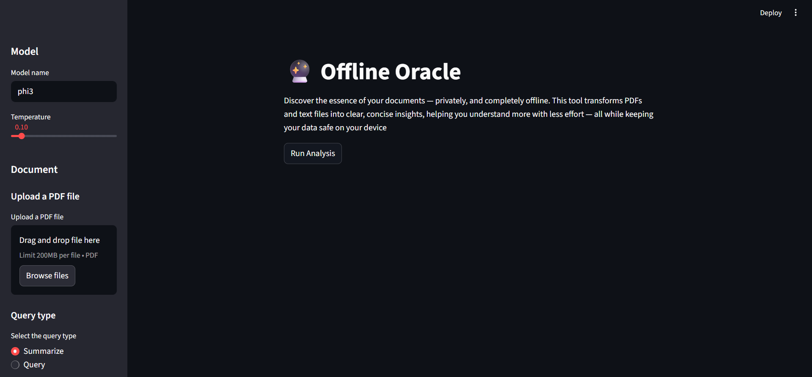

# Offline Oracle

An interactive web application to summarize and query PDF documents using locally-run Large Language Models (LLMs). This project is designed for privacy, as all processing happens entirely on your own machine.


*(A screenshot of the Streamlit application interface)*

## Features

- **Upload PDF Documents**: Easily upload PDF files through the web interface.
- **Summarize Content**: Generate a concise summary of the entire document or a specific range of pages.
- **Query Documents**: Ask specific questions about the document's content and get detailed answers.
- **100% Local and Private**: Runs completely offline using Ollama. No data ever leaves your computer.
- **Configurable**: Easily change the LLM model, temperature, and page range from the UI.
- **User-Friendly Interface**: Built with Streamlit for a clean and simple user experience.

## Technology Stack

- **Backend**: Python
- **LLM Serving**: [Ollama](https://ollama.com/)
- **AI Framework**: [LangChain](https://www.langchain.com/)
- **Web UI**: [Streamlit](https://streamlit.io/)

---

## Setup and Installation

Follow these steps to get the application running on your local machine.

### 1. Prerequisites

Before you begin, ensure you have the following installed:
- **Python 3.8 or newer**.
- **Ollama**: Install it from the official website at [ollama.com](https://ollama.com/).
- **An Ollama Model**: This project is configured to use `phi-3`. Download it by running the following command in your terminal:
  ```bash
  ollama run phi3
  ```

### 2. Installation Steps

1.  **Clone the repository:**
    ```bash
    git clone https://github.com/tamim00077/Offline-Oracle.git
    cd Offline-Oracle
    ```

2.  **Create and activate a Python virtual environment:**
    ```bash
    # Create the environment
    python -m venv venv

    # Activate the environment
    # On Windows:
    .\venv\Scripts\activate
    # On macOS/Linux:
    source venv/bin/activate
    ```
    You should see `(venv)` at the beginning of your terminal prompt.

3.  **Install the required packages:**
    ```bash
    pip install -r requirements.txt
    ```

### 3. Configuration

The application uses an environment file to configure the model.

1.  **Rename the sample file**: Find the file named `.env-ollama` in the project directory and rename it to `.env`.

2.  **Verify the content**: Open the `.env` file and ensure it is configured for your local Ollama instance and the `phi3` model. It should look like this:
    ```
    OPENAI_URL="http://localhost:11434/v1"
    OPENAI_API_KEY="ollama"
    MODEL_NAME="phi3"
    ```

---

## Running the Application

1.  Make sure Ollama is running in the background.
2.  Ensure your virtual environment is activated (you should see `(venv)` in your terminal prompt).
3.  Launch the Streamlit app with the following command:
    ```bash
    streamlit run doc_app.py
    ```
This will open the application in a new tab in your web browser.

## How to Use

1.  **Configure Model (Optional)**: Use the sidebar to change the model name or adjust the temperature.
2.  **Upload Document**: Click "Browse files" or drag and drop a PDF file into the upload area.
3.  **Set Page Range**: Specify the start and end pages you wish to analyze. Use `0` for the first page and `-1` for the last page.
4.  **Select Query Type**:
    - **Summarize**: To get a general summary of the selected pages.
    - **Query**: To ask a specific question about the document. A text box will appear for your question.
5.  **Run**: Click the "Run" button and wait for the model to process the document and generate a response.

---

## License

This project is licensed under the MIT License.